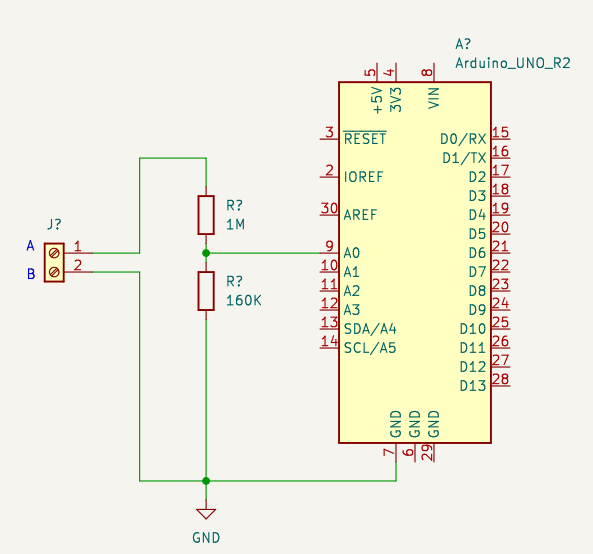

## Description

This is a simple serial to mqtt bridge for [TCS](https://www.tcsag.de/) intercom systems.

It uses the [TCSintercomArduino](https://github.com/atc1441/TCSintercomArduino/tree/master)/[TCSparserUNO](https://github.com/atc1441/TCSintercomArduino/blob/cc15cc9029bb4e1e3fbac9d890c999ca26596c10/TCSparserUNO/TCSparserUNO.ino) arduino code to listen on the bus, and publish a "Klingel betätigt!" on a custom mqtt topic.<br />
This can then be used, for example with [gotify](https://gotify.net/), to send notifications on your smarthphone.


## Environment variables
| Name               | Default value  | Required | Description                                                              |
| ------------------ | -------------- | -------- | ------------------------------------------------------------------------ |
| SERIAL_PORT        | `/dev/ttyACM0` |          | Arudino Serial Port                                                      |
| SERIAL_BAUD        | `9600`         |          | configred baud rate for the serial port                                  |
| MQTT_HOST          | `27017`        |          | MQTT Host                                                                |
| MQTT_PORT          | `OpenHaus`     |          | MQTT Port                                                                |
| MQTT_TOPIC         | `doorman`      |          | MQTT Topic                                                               |
| SERIALS            |                |          | Comma seperated list, when to notfiy via mqtt. E.g.: `1D2CC541,0D2CC580` |
| GOTIFY_INTEGRATION |                |          | Sets gotify specify values/json data, if set to `true`                   |

You can also create a `.env` file. E.g:
```ini
MQTT_HOST="open-haus.lan"
SERIALS="1D2CC541,0D2CC580"
```


## Installation
1) copy the `index.js` where ever you want to. E.g, `/opt/tcs-montior-mqtt-bridge/index.js`
2) run `npm install`
3) run `node index.js`

Make sure your arudino bridge is attached via USB, when you start the node.js application.

## Schematics



## Todos
- Audio capture
- Open the door/use buzzer